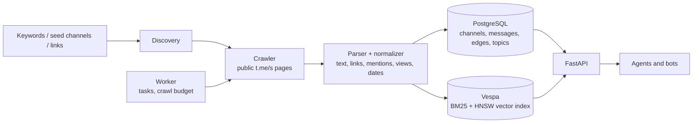

# TG Radar

Agent-ready index of public Telegram channels: it discovers channels from keywords and seed
graphs, crawls their public `t.me/s/...` pages, keeps crawl state in PostgreSQL, indexes
messages into Vespa for hybrid retrieval, and exposes a FastAPI surface for agents and bots.

The interesting part is not the crawler but the guarantees around it: the same message never
lands twice, the index can be rebuilt from PostgreSQL, and search keeps working when Vespa is
unavailable.

## How it works



- **Discovery** merges three sources: keyword search over public pages, graph expansion from
  seed channels (forward/repost and mention edges), and explicit channel lists.
- **Crawl** reads public `https://t.me/s/<channel>` pages — no Telethon in the default path,
  so the service runs without a user account.
- **Normalize** extracts messages, links, mentions, views, dates and forward hints, then
  upserts them.
- **Index** pushes messages into Vespa; if Vespa is down, `/search` falls back to PostgreSQL
  full-text search instead of failing.
- **Serve** returns channels, messages, topics and search results to agents, plus a collection
  agent that can run keyword tasks on a schedule.

## Key features

- Keyword discovery plus graph expansion from seeds, with per-run and per-day crawl budgets.
- Recurring keyword tasks (`/tasks`) with intervals, limits and depth, editable at runtime.
- Hybrid retrieval: BM25 over message text and HNSW over 1024-dim embeddings, with filters on
  channel, date and quality score.
- Idempotent ingest: messages are unique by `(channel_id, tg_msg_id)` and by content hash;
  channels are unique case-insensitively; discovery edges and candidates have their own unique
  keys.
- Topic admission: candidate channels pass a topic gate before they enter the crawl set.
- Bot tooling: cards, digests and an LLM collection agent with a bounded context budget.
- Telethon path is optional and additive; the default pipeline needs no user session.
- Prometheus metrics and `/health` + `/core/health/deep` probes.

## Engineering decisions

**Decision: PostgreSQL is the source of truth, Vespa is a derived index.**
**Why:** crawl state, channel graph and message history must survive an index wipe; Vespa
documents can be rebuilt by re-indexing from the database.
**Trade-off:** re-indexing is a batch job, and the two stores can drift until it runs.

**Decision: search falls back to PostgreSQL full-text when Vespa is unavailable.**
**Why:** degraded search beats a 500 for an agent that only needs to know whether a channel
mentioned something.
**Trade-off:** ranking quality drops; the response reports which backend served it.

**Decision: uniqueness is enforced in the database, not in the parser.**
**Why:** crawls overlap (a repost, a re-run, two workers), so de-duplication has to survive
concurrent writers.
**Trade-off:** inserts must handle conflict paths, and the schema carries more indexes.

**Decision: crawl budget per token and per day.**
**Why:** keyword discovery can explode into thousands of candidates; the budget keeps a single
client from consuming the whole crawl capacity.
**Trade-off:** some discoveries are deferred to the next day instead of being crawled now.

**Decision: the API process serves HTTP while the worker owns schedules.**
**Why:** a restart of the API should not stop recurring tasks, and the worker can be scaled
independently.
**Trade-off:** two processes to operate, and task state lives in the database rather than in
memory.

**Decision: `t.me/s` pages instead of a user session.**
**Why:** no phone number, no session files, no account bans in the default path.
**Trade-off:** only public channels are visible, and the HTML layout is an external contract
that can change.

## Quick start

```bash
cp .env.example .env      # database URL, API token, optional LLM settings
docker compose up --build
```

Services: `postgres`, `vespa`, `api` (HTTP), `worker` (tasks and agent runs), `frontend`.

```bash
curl http://localhost:8080/health
curl http://localhost:8080/core/health/deep

curl -X POST http://localhost:8080/ingest \
  -H 'content-type: application/json' \
  -d '{"keywords":["AI agents hiring"],"seed_channels":["aostrikov_ai_agents"],"depth":1,"limit":30,"crawl":true}'

curl -X POST http://localhost:8080/tasks \
  -H 'content-type: application/json' \
  -d '{"name":"ai-hiring","keywords":["AI agents hiring"],"depth":2,"limit":50,"interval_seconds":300,"enabled":true}'

curl -X POST http://localhost:8080/engine/start
curl 'http://localhost:8080/search?q=agent&limit=10'
```

Authenticated deployments send `Authorization: Bearer $TG_RADAR_API_TOKEN`; when the token is
empty the API runs open for local development.

## Testing

```bash
.venv/bin/python -m pytest -q      # 187 passed, no network and no Vespa required
```

The suite covers discovery, ingest idempotency, topic admission, ranking fallbacks, API routes,
agent runtime and card rendering. Fixtures live in `tests/fixtures/`. The tests deliberately do
not read a developer's `.env`: API-token behaviour is pinned inside the test module.

## Layout

```text
src/tg_radar/
  api.py, api_routes/   # FastAPI app and route modules
  service.py            # ingest service: discovery -> crawl -> normalize -> store -> index
  crawler.py, parser    # public t.me/s crawling and HTML parsing
  db.py, migrations/    # SQLAlchemy models and Alembic migrations
  vespa/                # Vespa client, feed and query building
  topical.py            # topic gate and admission rules
  agent*, auto_search   # collection agent, keyword tasks, run registry
vespa/                  # Vespa application: hosts, services, message schema
frontend/               # operator UI (Vite)
tests/                  # regression suite and fixtures
```

## Limitations

- Only public channels are reachable through the default `t.me/s` path.
- Discovery quality depends on public search results, which are not an official API.
- Vespa schema changes require re-indexing; the repository ships the application package but
  not a migration tool for the index.
- The collection agent needs an OpenAI-compatible endpoint; without it, ingest and search
  still work.
- Estimated view counts and repost hints come from the public HTML and can be missing.

## License

MIT (see [LICENSE](LICENSE)).
